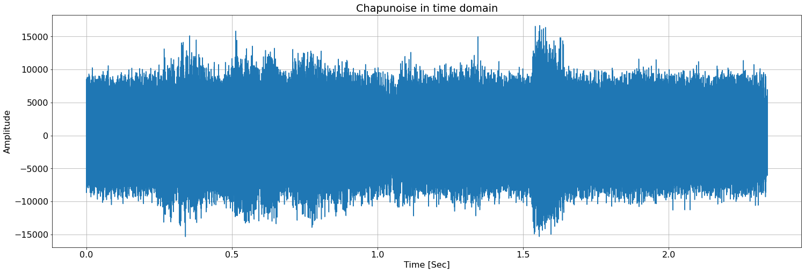
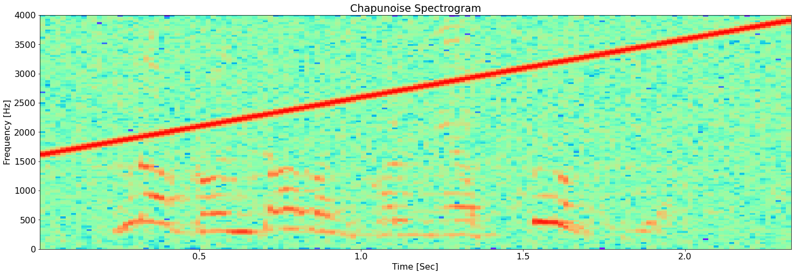
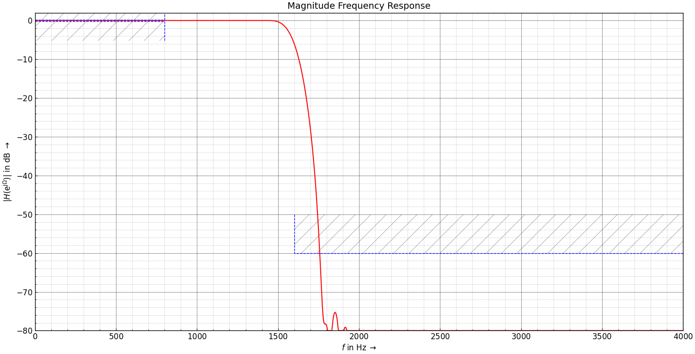
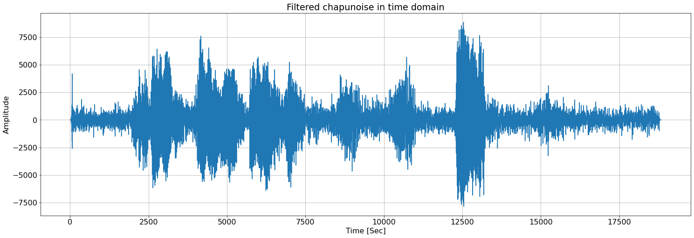
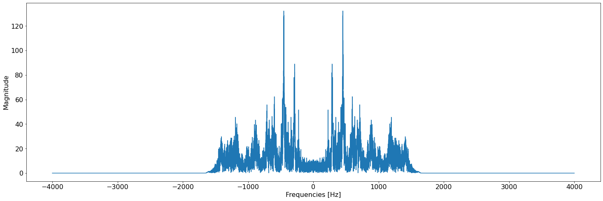
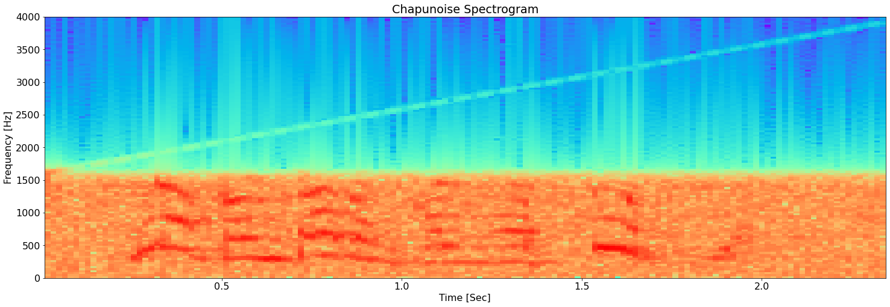

# DFT
## Ejercicio I
### Consigna
Grafique las siguientes señales lado a lado con su respectivo espectro en frecuencias:  

* Senoidal. 
* Cuadrada. 
* Triangular 
* Delta en t=0. 

Indicando en cada caso los siguientes parámetros (si corresponde): 

* Frecuencia. 
* Amplitud. 
* Potencia promedio. 
* Frecuencia de sampling. 
* Número de muestras. 

Pegue el link a un pdf con los códigos, gráficos y comentarios.

### Resolución


```python
import numpy as np
import matplotlib.pyplot as plt
from scipy import signal
from copy import deepcopy as cpy
from dataclasses import dataclass

@dataclass
class PsfWaveformSpec:
  fo_hz: float
  fs_hz: float
  samples_n: int
  ph_rad: float = 0
  amp: float = 1

@dataclass
class PsfWaveformData(PsfWaveformSpec):
  power_time: float = 0
  power_freq: float = 0


# Waveform Generators.
def psf_sine(spec: PsfWaveformSpec):
  amp = 0 if spec.amp < 0 else 1 if spec.amp > 1 else spec.amp
  n = np.arange(spec.samples_n) 
  return amp * np.sin((2 * np.pi * spec.fo_hz * n / spec.fs_hz) + spec.ph_rad)

def psf_square(spec: PsfWaveformSpec):
  amp = 0 if spec.amp < 0 else 1 if spec.amp > 1 else spec.amp
  n = np.arange(spec.samples_n) 
  return amp * signal.square(2 * np.pi * spec.fo_hz * n / spec.fs_hz + + spec.ph_rad, .5) 
  
def psf_tri(spec: PsfWaveformSpec):
  amp = 0 if spec.amp < 0 else 1 if spec.amp > 1 else spec.amp
  n = np.arange(spec.samples_n) 
  return amp * signal.sawtooth(2 * np.pi * spec.fo_hz * n / spec.fs_hz + + spec.ph_rad, .5) 

def psf_delta(spec: PsfWaveformSpec):
  amp = 0 if spec.amp < 0 else 1 if spec.amp > 1 else spec.amp
  sn = np.zeros(spec.samples_n) 
  sn[0] = 1.0
  return sn


# Utilities.
def psf_spec_to_time_sec(spec: PsfWaveformSpec):
  return np.arange(spec.samples_n) * 1/spec.fs_hz

def psf_gen_cont_and_disc_wvfm(spec: PsfWaveformSpec, fun=psf_sine):
  spec_cont = cpy(spec)
  spec_cont.fs_hz = spec_cont.fs_hz * 100
  spec_cont.samples_n = spec_cont.samples_n * 100
  return (psf_spec_to_time_sec(spec), fun(spec)), (psf_spec_to_time_sec(spec_cont), fun(spec_cont))  

def easy_fft(x, fs):
    fft = np.abs(np.fft.fftshift(np.fft.fft(x)/len(x)))
    fft_fs = np.fft.fftshift(np.fft.fftfreq(len(x), 1/fs))
    return fft, fft_fs

def get_avg_power_f(X):
  return np.sum(abs(X)**2)

def get_avg_power_t(x):
  return np.sum(x**2) / len(x)


font = {'weight' : 'normal',
        'size'   : 12}

plt.rc('font', **font)
```


```python
def get_avg_power(spectrum):
  return np.sqrt(np.sum(spectrum**2))


font = {'weight' : 'normal',
        'size'   : 22}

plt.rc('font', **font)

wfm = PsfWaveformSpec(
    fo_hz = 10,
    fs_hz = 1000,
    samples_n = 500,
    ph_rad = 0,
    amp = 1
)

waveforms = (psf_square, psf_sine, psf_tri, psf_delta)

fig, axs = plt.subplots(len(waveforms), 2 , figsize=(30, 30), gridspec_kw={'width_ratios': [1, 4]})


for i, fun in enumerate((psf_square, psf_sine, psf_tri, psf_delta)):
  time = np.arange(0, wfm.samples_n) * 1/wfm.fs_hz
  sig = fun(wfm)
  fft, fft_fs = easy_fft(sig, wfm.fs_hz)
  
  d = PsfWaveformData(power_freq=get_avg_power_f(fft), power_time=get_avg_power_t(sig),  **wfm.__dict__)
  axs[i, 0].plot(time, sig, label=fun.__name__)
  axs[i, 0].legend()
  axs[i, 0].set_xlabel('Time [Sec]')
  axs[i, 0].set_ylabel('Magnitude')
  axs[i, 1].set_title(str(d))
  axs[i, 1].plot(fft_fs, fft, '-o', label=fun.__name__)
  axs[i, 1].legend()
  axs[i, 1].set_xlabel('Frequencies [Hz]')
  axs[i, 1].set_ylabel('Magnitude')
  axs[i, 1].set_xticks(range(-490, 500, 40))
  axs[i, 1].set_xticklabels(range(-490, 500, 40), rotation=40)

plt.tight_layout()
plt.show()

```


    

    


### Comentarios
Se puede observar que:

* El espectro de la señal cuadrada cuenta con contenido armónico múltiplo de la
frecuencia original, pero con armonicos _pares_ nulos. 

* El espectro de la señal triangular es similar al de la cuadrada, pero la 
atenuación de cada armónico es aún mayor (cuadrática inversa vs lineal inversa).

* El espectro de la señal senoidal consiste de únicamente un pico de frecuencia
real positiva, con su contraparte en frecuencias negativas.

* El espectro de la delta es una constante. Cabe destacar que el valor de dicha 
constante es tal que su *energía* total en el espectro es igual a 1 (que es
la amplitud de la delta en tiempo). 
Cobra más sentido hablar de energía en este caso dado que no es una señal 
periódica como las anteriores.

## Ejercicio II
### Consigna
Dado el archivo clases/tp2/resolucion_espectral.txt  que contiene 100 valores reales sampleados a Fs=200Hz, indique: 

* Resolución espectral. 

* Espectro en frecuencia de la señal. 

* A simple inspección que frecuencia(s) distingue. 

* Aplique alguna técnica que le permita mejorar la resolución espectral y tome nuevamente el espectro. 

* Indique si ahora los resultados difieren del punto 3 y argumente su respuesta. 

* Pegue el link a un pdf con los códigos, gráficos y comentarios.

### Resolución


```python
import numpy as np
import scipy


font = {'weight' : 'normal',
        'size'   : 16}

plt.rc('font', **font)

# Constants.
FS = 200
PSF_FILE = './data/resolucion_espectral.txt' 
PADDING_SIG_LEN_MULT = 5

# Waveform loading.
with open(PSF_FILE) as f:
    sig = np.array(eval(f.read()))
    time = np.arange(len(sig)) * 1/FS

# Original signal in time domain.
plt.figure(figsize=(25,8))
plt.plot(time, sig)
plt.grid()
plt.ylabel('Amplitude')
plt.xlabel('Time [Sec]')
plt.title('Original signal in time domain')
plt.show()

# Original signal spectrum
## FFT & peak detection.
fft, freqs = easy_fft(sig, FS)
peaks_ind, peaks = scipy.signal.find_peaks(fft, height=0.15)
peaks_fs = [freqs[i] for i in peaks_ind]
peaks_vals = peaks['peak_heights']
# ---
plt.figure(figsize=(25,8))
plt.plot(freqs, fft)
plt.plot(peaks_fs, peaks_vals, 'o')
for f in peaks_fs:
    plt.axvline(x=f, color='r', linestyle='--')
plt.title('Original Signal Spectrum')
plt.xticks(np.concatenate((np.linspace(-100, 100, 11), peaks_fs)), rotation=45)
plt.xlabel('Frequencies [Hz]')
plt.ylabel('Magnitude')
plt.show()


# Signal padded
## FFT & peak detection.
sig_padded = np.concatenate((sig, np.zeros(924)))
fft, freqs = easy_fft(sig_padded, FS)
peaks_ind, peaks = scipy.signal.find_peaks(fft, height=0.02)
peaks_pd_fs = [freqs[i] for i in peaks_ind]
peaks_vals = peaks['peak_heights']
plt.figure(figsize=(25,8))
plt.plot(freqs, fft)
plt.plot(peaks_pd_fs, peaks_vals, 'o')
for f in peaks_pd_fs:
    plt.axvline(x=f, color='r', linestyle='--')
plt.xticks(np.concatenate((np.linspace(-100, 100, 11), peaks_pd_fs)), rotation=45)
plt.xlabel('Frequencies [Hz]')
plt.ylabel('Magnitude')
plt.title('Signal Spectrum (zerop added)')
plt.show()

print(f'Peaks before padding (Hz): ' + '; '.join(map(str, peaks_fs)))
print(f'Peaks after padding (Hz): ' + '; '.join(map(str, peaks_pd_fs)))


```


    

    


    

    


    

    


    Peaks before padding (Hz): -50.0; 50.0
    Peaks after padding (Hz): -52.5390625; -49.8046875; 49.8046875; 52.5390625


### Comentarios
Puede observarse que, con la resolución espectral resultante de utilizar
únicamente el número de muestras de la señal original, se pueden distinguir
solo dos picos en +-50 Hz. A priori la asimetría en la envolvente de los picos
permite sospechar que no se trata de un tono puro, pero resulta imposible comprender
exactamente cómo está conformada la señal.

Luego de aplicar la técnica de `Zero Padding` para aumentar la resolución en
frecuencia (a costas de una menor SNR) se pueden distinguir claramente dos picos
de frecuencias en 48.9Hz y 52.5Hz (con su contrapartida negativa). Esto 
deja ver que, posiblemente, la señal original se trate de una
suma de dos tonos. 

La resolución original en frecuencia es de 2Hz y la distancia entre los picos luego del padding se vé cercana a 3.5Hz. Esto implica que en el espectro sin paddear, dos bines consecutivos en la zona de interés caen en picos distintos y no permite distinguirlos (no hay un punto intermedio que no sea parte de un pico para diferenciarlos).

# IDFT
## Ejercicio I
### Consigna
En el archivo clases/tp2/fft_hjs.npy se almacenaron los valores de un espectro en frecuencia correspondientes a una señal desconocida. Indique: 

* Puede estimar que representa esta señal? (tip: grafique en 2d la idft)

* Hasta que punto podría limitar el ancho de banda del espectro dado en el archivo y que aun se logre interpretar la señal?

* Pegue el link a un pdf con los códigos y los gráficos utilizados.

### Resolución


```python
import numpy as np
sig_spectrum = np.load('./data/fft_hjs.npy')

def ifft_2d(x):
    sig = np.fft.ifft(x)
    return (np.imag(sig), np.real(sig))

def spectrum_truncate(x, n):
    return np.concatenate((x[:n], x[len(x)-n:]))
    

test_points =(500, 250, 225, 200, 150, 100, 50, 25, 10)
fig, axs = plt.subplots(nrows=3, ncols=3, figsize=(20, 20))
for i in range(3):
    for j in range(3):
        x, y = ifft_2d(spectrum_truncate(sig_spectrum, test_points[3*i + j]))
        axs[i, j].plot(x, y)
        axs[i, j].set_title(f'Samples: {2 * test_points[3*i + j]} / BW Ratio: {test_points[3*i + j] / 500} fo')
plt.show()
```


    

    


### Comentarios
Puede observarse como el Homero modelado por el espectro de la señal
original se va deformando a medida que se reducen las muestras. Por inspección,
tomando únicamente 200 muestras de las 1000 originales sería suficiente para
reconocer a Homero (y quizás con 100 también).

# Filtrado: CIAA
## Ejercicio
### Consigna
Dado el segmento de audio almacenado en el archivo clases/tp2/chapu_noise.npy con Fs=8000, mono de 16b y contaminado con ruido de alta frecuencia: 

* Diseñe un filtro que mitigue el efecto del ruido y permita percibir mejor la señal de interés 
* Filtre con la CIAA utilizando alguna de las técnicas vistas 
* Grafique el espectro antes y después del filtro. 
* Reproduzca el audio antes y después del filtro 
* Pegue el link a un .zip comentando los resultados y los criterios utilizados, la plantilla del filtro con capturas de la herramienta de diseño y un video mostrando la CIAA/HW en acción y la reproducción de audio antes y después del filtrado.

### Resolución
#### Análisis de señal


```python
import numpy as np
import matplotlib.pyplot as plt

FS_HZ = 8_000
chapunoise = np.load('./data/chapu_noise.npy')
time = np.arange(len(chapunoise)) * 1 / FS_HZ

plt.figure(figsize=(25,8))
plt.plot(time, chapunoise)
plt.grid()
plt.ylabel('Amplitude')
plt.xlabel('Time [Sec]')
plt.title('Chapunoise in time domain')
plt.show()

fft, fft_fs = easy_fft(chapunoise, FS_HZ)
plt.figure(figsize=(25,8))
plt.xlabel('Frequencies [Hz]')
plt.ylabel('Magnitude')
plt.plot(fft_fs, fft)
plt.show()

plt.figure(figsize=(25,8))
plt.title('Chapunoise Spectrogram')
plt.specgram(chapunoise, Fs=FS_HZ, cmap="rainbow")
plt.xlabel('Time [Sec]')
plt.ylabel('Frequency [Hz]')
plt.show()
```


    

    


    

    


    

    


#### Comentarios iniciales
Luego de analizar la señal, puede observarse claramente en el espectrograma anterior
una señal del tipo "chirp" (o sweep de frecuencia) a la par de la señal de 
interés. Se empleará un filtro para eliminar el sweep por completo, a sabiendas
de que se degradará levemente la señal de interés (ya que algunos componentes
de frecuencia - armónicos de las principales - se encuentran en la banda a 
atenuar).



#### Filtrado


Es relevante destacar que dado que el filtro no cae abruptamente, sería posible 
(con mucha atención) percibir auditivamente el principio de la chirp previo
al comienzo de la señal de voz. 
Esto se debe que:

* Se ha optado por no decrementar la frecuencia de corte para no perder calidad 
en la señal de voz.

* No utilizar una mayor cantidad de muestras (lo cual mejoraría la pendiente)
para agilizar el procesamiento en el MCU.

#### Implementación del filtro / Verificación en Python


```python
chapu_filter = np.array(np.load('./data/chapu_filter.npy')[0]).astype(float) 
filtered = np.convolve(chapu_filter, chapunoise)

plt.figure(figsize=(25,8))
plt.plot(filtered)
plt.grid()
plt.ylabel('Amplitude')
plt.xlabel('Time [Sec]')
plt.title('Filtered chapunoise in time domain')
plt.show()

fft, fft_fs = easy_fft(filtered, FS_HZ)
plt.figure(figsize=(25,8))
plt.xlabel('Frequencies [Hz]')
plt.ylabel('Magnitude')
plt.plot(fft_fs, fft)
plt.show()


plt.figure(figsize=(25,8))
plt.title('Chapunoise Spectrogram')
plt.specgram(filtered, Fs=FS_HZ, cmap="rainbow")
plt.xlabel('Time [Sec]')
plt.ylabel('Frequency [Hz]')
plt.show()
```


    

    


    

    


    

    


#### Comentarios post filtrado

Se observa tanto en el gráfico de frecuecnia como en el esprectrograma que 
la banda de frecuencias indeseadas ha sido removida con éxito.

#### CIAA: Implementación en C


```c
#include "sapi.h"
#include "arm_math.h"
#include "arm_const_structs.h"
#include "fir.h" 

#define BITS    10   // cantidad de bits usado para cuantizar

int16_t offset = 512;
int16_t zero = 0;

struct header_struct {
   char     pre[8];
   uint32_t id;
   uint16_t N;
   uint16_t fs ;
   uint16_t hLength ;
   char     pos[4];
} __attribute__ ((packed));

struct header_struct header={"*header*",0,128,8000,h_LENGTH,"end*"};

int main ( void ) {
   uint16_t sample = 0;
   int16_t adc   [ header.N            ];
   int16_t y     [ h_LENGTH+header.N-1 ];

   boardConfig();
   uartConfig(UART_USB, 460800);
   adcConfig (ADC_ENABLE);
   dacConfig(DAC_ENABLE);
   cyclesCounterInit (EDU_CIAA_NXP_CLOCK_SPEED);

   for(;;) {
      cyclesCounterReset();
      adc[sample] = (((int16_t )adcRead(CH1)-512)>>(10-BITS))<<(6+10-BITS);
      dacWrite(DAC, y[sample]); // will be 128 samples delayed from input.
      if (++sample==header.N ) {
         gpioToggle ( LEDR );
         sample = 0;
         arm_conv_q15(adc, header.N, h, h_LENGTH, y);
         header.id++;
         uartWriteByteArray(
            UART_USB,
            (uint8_t*)&header,
            sizeof(struct header_struct)
         );
         for (int i=0;i<(header.N+h_LENGTH-1); i++) {
            uartWriteByteArray (
               UART_USB,
               (uint8_t*)(i<header.N ? &adc[i] : &offset),
               sizeof(adc[0])
            );
            uartWriteByteArray(
               UART_USB,
               (uint8_t* )(i<h_LENGTH ? &h[i] : &zero),
               sizeof(h[0])
            );
            uartWriteByteArray(
               UART_USB,
               (uint8_t*)(&y[i]),
               sizeof(y[0])
            );
         }
         adcRead(CH1);
      }
      gpioToggle(LED1);
      while(cyclesCounterRead() < EDU_CIAA_NXP_CLOCK_SPEED / header.fs)
         ;
   }
}

```

El archivo `fir.h` puede obtenerse del repositorio [Github](https://github.com/lorsi96/Signal-Processing-Fundaments---MSE07/blob/master/ciaa_chapunoise/src/fir.h).

#### Comparación auditiva


```python
# Reproducción de audio antes/después.
from IPython.display import display, Audio
from ipywidgets import interactive

# display(Audio(data=chapunoise, rate = 8000, autoplay=False))
# display(Audio(data=filtered, rate = 8000, autoplay=False))
```

#### Videos Demostrativos


[Captura de señales CIAA](https://raw.githubusercontent.com/lorsi96/Signal-Processing-Fundaments---MSE07/master/images/hardware/CIAA_Filter.gif)

[Hardware + CIAA Funcionando](https://drive.google.com/file/d/1KMyS2J_aEVPtWXeZJMkIJLJTIG-PdBv0/view?usp=sharing)

